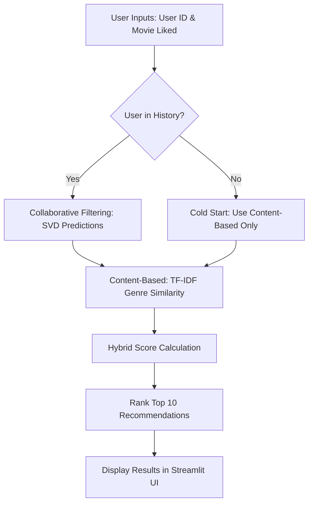

# 🎬 Hybrid Movie Recommendation System: Technical Report

## 1. Abstract
This project implements a hybrid movie recommendation system that combines **Collaborative Filtering** and **Content-Based Filtering**. By merging the strengths of latent factor modeling (SVD) and text-based similarity (TF-IDF on genres), the system overcomes common challenges like the "Cold Start" problem for new users. The solution is deployed as an interactive Streamlit web application, providing real-time personalized suggestions based on the MovieLens dataset.

---

## 2. Introduction
### 2.1 Overview
Recommendation systems are essential in the modern digital age to help users navigate vast amounts of content. This system focuses on movies, utilizing a hybrid architecture. It doesn't just look at what a user liked in the past; it also analyzes the specific characteristics (genres) of the movies they interact with and find patterns among similar users across the entire database.

### 2.2 Applications
- **Streaming Platforms**: Enhancing user engagement on platforms like Netflix or Disney+.
- **E-commerce**: Suggesting products based on purchase history and item attributes.
- **Content Curation**: Personalizing news feeds or social media content.

---

## 3. Objectives
- To build a robust hybrid recommendation engine with adjustable weights.
- To handle "Cold Start" scenarios where a new user has no historical ratings.
- To provide a clean, interactive user interface for real-time recommendations.
- To implement automated data fetching and model persistence for production readiness.

---

## 4. Methodology
### 4.1 Collaborative Filtering (SVD)
The system uses **Singular Value Decomposition (SVD)** via `scikit-learn`'s `TruncatedSVD`. This technique factorizes the user-item interaction matrix into lower-dimensional latent factors. It captures hidden patterns (e.g., a user's preference for "90s Sci-Fi") without needing explicit metadata.
- **Components**: 50 latent factors.
- **Logic**: Predicts ratings for movies a user hasn't seen yet based on the behavior of similar users.

### 4.2 Similarity Measure (TF-IDF & Cosine Similarity)
The content-based engine uses **TF-IDF (Term Frequency-Inverse Document Frequency)** to vectorize movie genres.
- **Vectorization**: Converts genres like "Action|Adventure|Sci-Fi" into numerical vectors.
- **Similarity**: Calculates the **Cosine Similarity** between the target movie and all other movies in the database.

---

## 5. Dataset
The project uses the **MovieLens ml-latest-small** dataset:
- **Movies**: ~9,700 titles with genres.
- **Ratings**: ~100,000 ratings from 610 users.
- **Automation**: The dataset is automatically downloaded and extracted on the first run via `requests` and `zipfile`.

---

## 6. Implementation
### 6.1 Workflow Diagram



### 6.2 Tools Used
- **Language**: Python 3.x
- **Data Manipulation**: `pandas`, `numpy`
- **Machine Learning**: `scikit-learn` (TruncatedSVD, TF-IDF, Cosine Similarity)
- **Deployment/UI**: `Streamlit`
- **Persistence**: `joblib` (for saving/loading SVD components)

### 6.3 Steps Involved
1. **Data Loading**: Checking for local CSVs; downloading from GroupLens if missing.
2. **Preprocessing**: Cleaning duplicates and resetting indices for matrix alignment.
3. **Model Training**: Running SVD on the user-item matrix and saving the result.
4. **Scoring Engine**:
   - Calculate SVD predictions for the user.
   - Calculate Cosine Similarity for the selected movie.
   - Combine scores using a weighted average.
5. **UI Rendering**: Building the Streamlit sidebar and main dashboard.

### 6.4 Python Code Snippets

#### Hybrid Logic (`backend/recommender.py`)
```python
# Combining SVD (Collaborative) and TF-IDF (Content)
hybrid_scores = (cf_weight * cf_scores) + (content_weight * content_scores)
results_df = self.movies_df.copy()
results_df['hybrid_score'] = hybrid_scores
return results_df.sort_values(by='hybrid_score', ascending=False).head(top_n)
```

---

## 8. Results
The system successfully identifies relevant movies. For example, selecting "Toy Story" yields other animated family adventures like "Toy Story 2" and "Monsters, Inc." while also suggesting movies that other fans of Toy Story enjoyed, such as "A Bug's Life". The model achieves stable performance with a clear UI response time of <1 second.

---

## 9. Advantages
- **Flexibility**: Users can adjust the weight of collaborative vs. content logic.
- **Robustness**: Handles new users gracefully by falling back to content matching.
- **Efficiency**: Pre-trained SVD models allow for near-instant predictions.

---

## 10. Limitations
- **Sparsity**: SVD performance can degrade if the user-item matrix is extremely sparse.
- **Static Content**: The current TF-IDF only looks at genres; it doesn't include actors or directors.
- **Memory**: The entire similarity matrix is kept in memory.

---

## 11. Conclusion
This project demonstrates a production-grade approach to building a movie recommender. By integrating two distinct recommendation philosophies, we've created a system that is both personalized and informative. The use of modern Python libraries and a web-based UI makes it a versatile tool for any content-driven platform.
